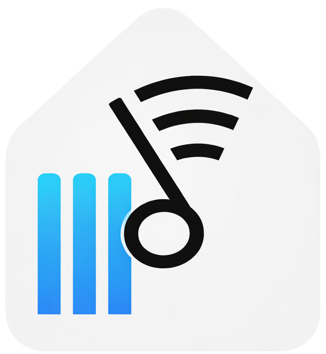

#  Bose SoundTouch Hybrid 2026 - V2

**A free, open-source private cloud streaming service replacing the Bose Cloud Service to maintain 100% of the smart speaker functionality of your SoundTouch 10, 20, & 30 Speakers and Wireless Link. Physical Presets Included!**

### ⚠️ THE PROBLEM
Bose's end-of-life announcement for their SoundTouch Cloud Service (scheduled May 2026) degrades the Bose SoundTouch intelligent, multi-room audio speakers into "dumb" receivers dependent on a phone's active connection. This represents a **significant loss of functionality** for the SoundTouch 10, 20, and 30 Speakers and Wireless Link Adapter.

###  THE SOLUTION: Bose SoundTouch Hybrid 2026
This project is a self-hosted "Private Cloud" to **emulate and replace the Bose Cloud Service**. It runs locally on your network (NAS, PC, etc.) and intercepts and actively manages the complex server handshakes required to keep the SoundTouch Speakers authenticated and functional, providing the **same phone-free audio streaming capabilities** as the original SoundTouch Application and Speakers. 

### ✨ Key Features
* **100% Local Control:** Your data and control logic stay on your LAN. No reliance on external Bose servers.
* **Complete App Replacement:** A single, responsive web interface for **Desktop** and **Mobile** that handles both streaming and speaker maintenance, completely eliminating the need for the legacy SoundTouch app or provider-specific streaming apps. Includes support for initial speaker setup, factory resets, WiFi provisioning, and the one-time automated injection of a speaker's internal cloud emulation configuration (`OverrideSdkPrivateCfg.xml`).

* **Hardware Intelligence Preserved:** 
  * ✅ **Local Bose Cloud Emulation:** Local replacement emulating  the required Bose Cloud handshakes to keeping the speakers authenticated and fully functional.
  * ✅ **The Physical 1-6 Preset Buttons:** Remain assignable to any source via the Hybrid Bridge and work instantly.
  * ✅ **Volume, Power, & Presets:** Physical speaker buttons remain fully functional and sync perfectly with the new Hybrid app.
  * ✅ **Native Hardware Grouping:** Utilizes Bose's near-zero-latency Master/Slave hardware grouping instead of software-level sync. This guarantees perfect multi-speaker audio regardless of whether you are streaming from a new Hybrid cloud source or a local input.
* **Expanded Music Universe:** Bridges your speakers to modern sources powered by Music Assistant (MASS)  
  * Spotify, Apple Music, YouTube Music
  * Local NAS Files, Plex, Jellyfin
  * Internet Radio (TuneIn, DI.fm)
  * Others from MASS
  * Global Agnostic Search within SoundTouch Hybrid Library of all your MASS sources

## 🛠 Architecture
* **Backend:** Custom Node.js/server acting as the "Audio Engine" (Music Assistant  ) and local Bose Cloud Emulation ☁️.
* **Frontend:** Responsive Web App deployable to any browser.
* **Connectivity:** Direct IP control over Bose WebSockets & XML API. 


### ☁️ BOSE CLOUD EMULATION AND HYBRID FEATURES:

### Authentication & Provisioning
* Full BMX Registry and MargeID handshakes
* Dynamic account profile generation
* Source Providers Authorization (e.g., `11`, `LOCAL_INTERNET_RADIO`)
* Automated injection of Hybrid Preset Physical Buttons (1-6)
* Automated Cloud Redirect Setup (points speakers to local server)

### Device Rescue (NVRAM Auto-Healer)
* Factory-reset speaker detection and setup
* Gabbo System Bus (Port `8080`) websocket backdoor access
* Automated UI setup bypass (Language → Name → Account Binding → Seal)
* Permanent NVRAM persistence flag generation (`<setupState state="SETUP_LEAVE" />`)

### System Traps & Speaker Protection
* Dummy radio base URL generation (streaming check bypass)
* DRM streaming token mocks
* Boot-loop prevention (Account deletion trap)
* Telemetry and analytics blocking
* Firmware update bypass 
* Factory reset request spoofing (Fake `201 Created`)
* Device rename and profile sync spoofing

### Server Stability & Caching
* Real-time speaker identity fetching (MAC, Serial, Name)
* Local identity caching to handle heavy network traffic
* Failsafe request dropping (protects busy speakers from accidental preset wipes)

## 📺  Demo Videos
<a href="https://youtu.be/R6mbTRBEBYA" target="_blank">
  
</a>
<a href="https://youtu.be/3BhAkpsZjBI" target="_blank">
  
</a>


##  Getting Started

Review **[SoundTouch Hybrid 2026 Technical Documentation](https://github.com/TJGigs/Bose-SoundTouch-Hybrid-2026/blob/main/public/docs/SoundTouchHybridDocumentation.pdf)** for detailed system architecture, technical development findings and solutions, and visual setup screenshots.

## Installations via Docker Compose

***You must verify your SoundTouch speakers and streaming providers are fully working inside of Music Assistant prior to using the SoundTouch Hybrid Application.***

###  Setting up Music Assistant (MASS)
Install Music Assistant (MASS):

1. **For installation instructions and troubleshooting, use Music Assistant Help:** This includes help for setup, providers, speakers testing, playback issues, etc.
   * See [MASS GitHub](https://github.com/music-assistant)
   * See [MASS Website](https://www.music-assistant.io/installation)
   * To run MASS using my specific configuration, I included my `mass_docker.yml` and `mass_package.json` files located in the `examples` subfolder. Your MASS install may or may not be the same but these are provided as reference.

2.	**Initial Setup:** Once MASS is installed go to it's web interface to create your login ID and password. These will be used by the SoundTouch Hybrid system to access MASS. (the SoundTouch Hybrid system does not require a MASS "Long-lived Access Token").

3.	**Configure Providers:** Add your desired streaming providers (e.g., Local NAS, TuneIn, Spotify, etc.) and configure any local Music Library synchronization options. Examples of synchronization options are on Page 12 in the [SoundTouch Hybrid Documentation](https://cdn.jsdelivr.net/gh/TJGigs/Bose-SoundTouch-Hybrid-2026@main/public/docs/SoundTouchHybridDocumentation.pdf#page=12)
    * I choose not to enable MASS local library synchronization for my providers to ensure that content search using the SoundTouch Hybrid Library search function (via MASS Search) is directly accessing the most recent data from streaming providers rather than relying on a local MASS cached and periodically sync'd copy. You may decide otherwise. 
   
5.	**Configure UPnP:** Enable the DLNA/UPnP provider and for each of your SoundTouch speakers ensure you ***"Enable Queue flow mode"***. See Page 11 in the [SoundTouch Hybrid Documentation](https://cdn.jsdelivr.net/gh/TJGigs/Bose-SoundTouch-Hybrid-2026@main/public/docs/SoundTouchHybridDocumentation.pdf#page=11) for an example.

6.	**Very Important:** Make sure Music Assistant itself can play audio to your speakers and you hear the audio. Do this completely independent of the Bose SoundTouch Hybrid app. Do this for every provider and speaker you add. This way you know Music Assistant is fully working first before proceeding to install/use the Bose SoundTouch Hybrid system

###  Setting up SoundTouch Hybrid

**1. Download or Clone** all files and the directory structure exactly as they appear in this GitHub repository to your local server.
```
📁 /DataVol1/Container/ (Your NAS/Server Docker Share)
└── 📁 Bose-SoundTouch-Hybrid-2026
    ├── 📄 .env                    <-- You must configure this file
    ├── 📄 device_state.js
    ├── 📄 library.json
    ├── 📄 package.json
    ├── 📄 README.md
    ├── 📄 server.js               <-- Main Node.js server
    ├── 📄 speakers.json           <-- Add your speaker IPs here
    ├── 📄 st-hybrid-docker.yml    <-- Docker compose deployment file
    ├── 📁 examples                <-- Reference and example configurations
    │   ├── 📄 mass_docker.yml
    │   ├── 📄 mass_package.json
    │   └── 📄 speakers.json
    ├── 📁 public                  <-- Frontend UI Files
    │   ├── 📄 admin.html
    │   ├── 📄 control.html
    │   ├── 📄 manager.html
    │   ├── 📄 tools.html
    │   ├── 📄 global_ui.js
    │   ├── 📄 style.css
    │   ├── 📄 manifest.json
    │   ├── 📁 docs                <-- Reference Documents
    │   │   ├── 📄 Architecture.png
    │   │   ├── 📄 ArchitectureIntro.png
    │   │   ├── 📄 SoundTouchHybridDocumentation.pdf
    │   │   ├── 📄 SoundTouchWebAPI.pdf
    │   │   ├── 📄 states.png
    │   │   └── 📄 UberBoseOpenAPI.json
    │   └── 📁 images              <-- UI Assets
    │       ├── 🖼️ bose_icon.png
    │       ├── 🖼️ hybrid_icon.png
    │       ├── 🖼️ ma_icon.png
    │       ├── 🖼️ ma_logo.png
    │       ├── 🖼️ nas_icon.png
    │       ├── 🖼️ spotify_icon.png
    │       └── 🖼️ TuneIn_icon.png
    └── 📁 routes                  <-- Backend Application Logic
        ├── 📄 admin.js
        ├── 📄 bose_cloud.js
        ├── 📄 bridge.js
        ├── 📄 controller.js
        ├── 📄 manager.js
        ├── 📄 mass.js
        ├── 📄 restart_ma.js
        └── 📄 utils.js
```
2. **Configure Speakers:** Update `speakers.json` file with your speakers' names and their respective IP addresses.
   * *Note: If your speakers use dynamic IP addresses, you must log into your router and assign them static/fixed IP addresses for the Hybrid Bridge to find them.*
   
3. **Configure Environment Variables:** Update `.env` with your File Server credentials, MASS credentials, and port configurations.
   * *Note: Your actual streaming provider passwords (Spotify, etc.) are managed inside Music Assistant, not in this file.* 
   
4. **Configure Docker Volume Path:** Open `st-hybrid-docker.yml` and locate the volumes: section. You must change the left side of the colon (/share/Container/bose-soundtouch-hybrid) to the actual absolute path where you saved the cloned folder on your specific NAS or server.

5. **Deploy the Application:** Use the `st-hybrid-docker.yml` file to create and deploy the container. Depending on your system's Docker environment, you can do this via:

   * Command Line: Open your terminal, navigate to the exact folder containing your st-hybrid-docker.yml file, and run the command: docker-compose up -d

   * GUI / Web Interface: Import the .yml file into your preferred Docker management interface (such as Portainer, Synology Container Manager, or QNAP Container Station) to build the application. (Note: The container uses `network_mode: "host"` to ensure seamless UPnP/DLNA discovery on your local network).

6. **Install the Web App:** Open your mobile browser and navigate to the SoundTouch Hybrid local web address (e.g., http://<YOUR_SERVER_IP>:3000/control.html). Tap **"Add to Home Screen"** to install it as a native-feeling app with a launch icon.

7. **Redirect SoundTouch Speakers to Your Local Cloud:** The final configuration step is to redirect your physical speakers away from the soon-to-be-deprecated Bose SoundTouch Servers (shutting down May 2026) and route them to the SoundTouch Hybrid's Bose Cloud replacement emulator. Open the Speaker Admin/System Tools page and follow the on-screen **"Bose Cloud Emulation Setup"** instructions to prepare a USB drive and inject the configuration override (`OverrideSdkPrivateCfg.xml`) into each of your speakers.

8. **Demo Video Reviews:**
   *  **Watch The Initial V1 📺[Bose SoundTouch Hybrid 2026](https://www.youtube.com/watch?v=R6mbTRBEBYA)** demo video to see all the functionality.
   *  **Watch The 📺[V2 Enhancements Bose SoundTouch Hybrid 2026 V2](https://www.youtube.com/watch?v=3BhAkpsZjBI)** demo video to review the latest functionality changes and additions.
   * *Note: The SoundTouch Hybrid Search interface features four customizable tabs whose display order can be rearranged directly in the UI. By default, these include one Global tab (MASS all inclusive provider-agnostic search) and three provider-specific tabs (MASS: Local NAS, TuneIn, and Spotify). To add additional provider specific search tabs or swap existing ones (e.g., changing Spotify to Apple Music), simply modify `manager.js` and `manager.html` to suit your preferences.*


## 🔗 Resources
 **[Bose SoundTouch Hybrid 2026 - Project Announcement](https://www.reddit.com/r/bose/comments/1rdzs7z/bose_soundtouch_hybrid_2026_official_public/)**

 **Music Assistant:** This project relies on  [Music Assistant](https://music-assistant.io/) for backend audio routing and provider aggregation. 

**Community Discussions:**
* **Official Shutdown Discussion:** The original community thread tracking Bose's EOL announcement and API release [Bose EOL Reddit](https://www.reddit.com/r/bose/comments/1o2cnhw/bose_ending_cloud_support_for_soundtouch/).
* **The Reddit "Alternative App" Megathread:** Ongoing conversation about replacing the Bose App. [Bose Alternatives Reddit](https://www.reddit.com/r/bose/comments/1o8my2n/soundtouch_app_alternatives/).
* **[GitHub Soundcork-repo](https://github.com/deborahgu/soundcork).**
* **[GitHub Ueberboese-repo](https://github.com/julius-d/ueberboese-api).**
* **The Bose Wiki (App Alternatives):** A community-maintained list of current workarounds and projects. [Bose Alternatives Wiki](https://bose.fandom.com/wiki/SoundTouch_app_alternatives).

## ⚠️ A Crucial Note for Future Developers
> I suggest reading the [SoundTouch Hybrid Documentation](https://github.com/TJGigs/Bose-SoundTouch-Hybrid-2026/blob/main/public/docs/SoundTouchHybridDocumentation.pdf) before forking or modifying the codebase. It will **save you days of frustrating trial and error testing and debugging that I went through**
> 
> The legacy Bose SoundTouch WebSockets and XML API have several undocumented quirks, strict timing requirements, and inconsistencies. The documentation details my technical findings, architectural constraints, solutions, and specific reasons why the app handles the hardware and software the way it does.
